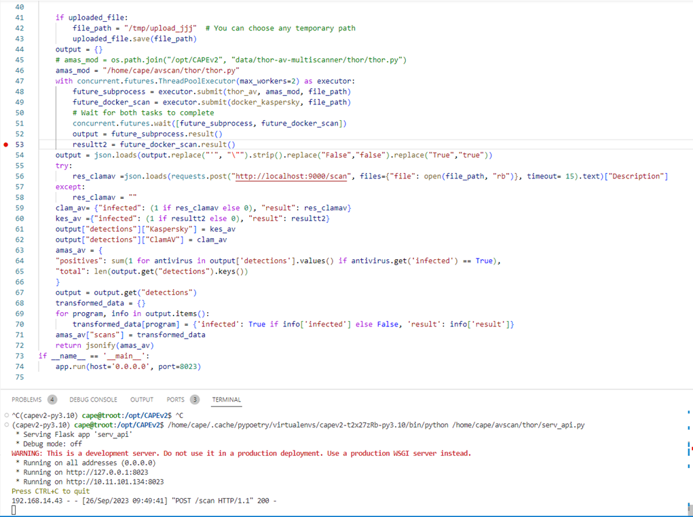
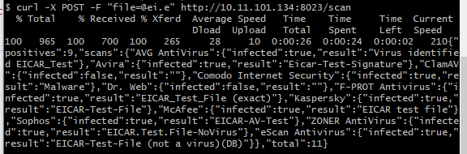
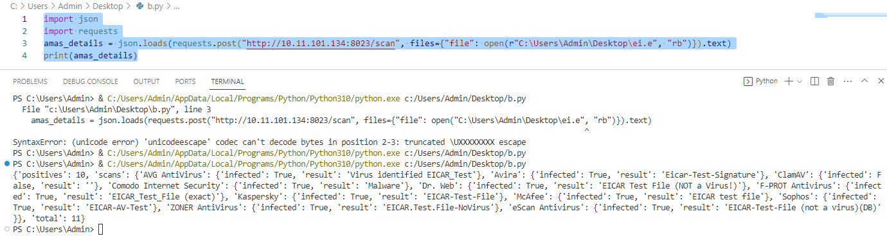

GUIDE SETUP AVSCAN


# Pull Docker AV necessary by script
[docker script](./thor/pull_av_docker.sh)

# Using crobtab create jobs update database AV daily
[cron script](./thor/crontab_jobs.sh)


# Run pyscript to start AV rest-api

Wget , download from link:

[http://192.168.14.155:8000/root/sandbox/-/tree/dev/data/thor-av-multiscanner/thor](http://192.168.14.155:8000/root/sandbox/-/tree/dev/data/thor-av-multiscanner/thor)
### Install package requirements.txt
Sau  do chạy servapi.py, để mở server nhận request scan file


## Test with curl
` curl -XPOST -F file=@RegDemo.exe -F mode=0 10.11.101.134:8023/scan`



## Hoặc dùng python request để gửi file nhận log:


```python
import json

import requests

amas_details = json.loads(requests.post("http://10.11.101.134:8023/scan", files={"file": open(r"/opt/CAPEv2/tests/test.zip", "rb"), "mode":(None,0)}).text)
print(amas_details)
```

print(amas\_details)



### Make AVscan start at BOOT
```bash
sudo cp avscan.service /lib/systemd/system/avscan.service
sudo systemctl daemon-reload
sudo systemctl enable avscan
sudo systemctl restart avscan
```